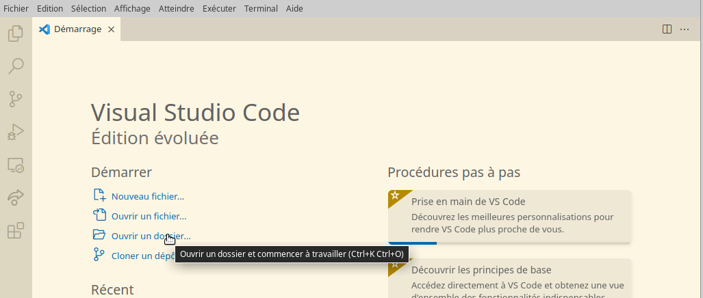

<link href="./Ressources/Theme/CSS/theme.css" rel="stylesheet">

<!-- _backgroundImage: url(./Ressources/Theme/Title.png) -->

# Installation vscode, .NET et extension c#

---


##	Sommaire
## Installation
- [Installation VSCode](#VSCodeInstall)
- [Installation NET 6.0](#NetInstall)
- [Installation c# Plugin pour VSCode](#CSharpInstall)
- [Voir sa version de .NET](#net6)
---
## [VSCode](#vscode)
- [Ouvrir un dossier / Fichier ](#opendir)
- [Créer un dossier / Fichier](#createdir)
- [Ouvrir un terminal](#openterm)


---


##  installation VSCode <a id="VSCodeInstall"></a>


GOTO :
https://code.visualstudio.com/#alt-downloads

---
## Installation .NET 6.0 <a id="NetInstall"></a>

Télécharger .NET 6.0 : https://dotnet.microsoft.com/en-us/download

---

## Téléchargement l'extension C#  <a id="CSharpInstall"></a>
- Pour cela ouvrir vscode, sur la barre latéral gauche cliquer sur Extension, puis dans Rechercher des extensions taper c#, puis installer comme indique si dessous

---


---


---


## Vérifier l'installation de .NET : <a id="net6"></a>

Nous voulons vérifier que nous avons bien installer .NET 6.0,
Pour cela, nous allons regarder la version actuel de .NET sur notre ordinateur a l'aide de commande de la commande ```dotnet --version```
 
  
Cliquer sur Terminal dans la bare d'option de vscode, puis Nouveau terminal

---

<!-- _backgroundImage: url(./Ressources/Theme/Flat.png) -->


---

## Vérifier l'installation de .NET

Une zone d'edition apparait en bas de l'application
Tapez y la commande suivante :
```dotnet --version ```
Puis la touche entre du clavier

Verifier que le retour vous donne la version 6.0.*

---

<!-- _backgroundImage: url(./Ressources/Theme/Flat.png) -->


---

#  Premier pas avec vscode <a id="vscode"></a>

---


## Comment ouvrir ce dossier avec vscode : <a id="opendir"></a>
En premier lieu, creer un dossier sur le bureau,

-	option 1 le drag and drop de fichier;
-	option 2 ouvrir directement un vscode et utiliser directement les options de demarage : ouvrir un dossier; Bureau -> nom_du_dossier_creer

---
<!-- _backgroundImage: url(./Ressources/Theme/Flat.png) -->


---

## Creer des dossiers / fichiers <a id="createdir"></a>
Pour creer des fichiers ou dossier avec VSCode, rien de plus simple.
Il suffit de cliquer sur les petites iconnes sur la droite du nom de dossier et le nommer: 


---
<!-- _backgroundImage: url(./Ressources/Theme/Flat.png) -->


---
<!-- _backgroundImage: url(./Ressources/Theme/Flat.png) -->


---


# Comment ouvrir un terminal : <a id="openterm"></a>


---
<!-- _backgroundImage: url(./Ressources/Theme/Flat.png) -->
- 1er option, utiliser Terminal en haut dans les options de VSCode entre Executer et Aide, puis Nouveau Terminal;


---

## Ouvrir un terminal 

- 2nd option, avec la sourit, tous en bas de vscode, grab et remonter pour faire apparaitre un terminal


---

## Ouvrir un terminal 

- 3eme option,
Pour ouvrir un terminal dans un sous-dossier, clic droit sur le nom du dossier et ouvrir dans le terminal integre

---
<!-- _backgroundImage: url(./Ressources/Theme/Flat.png) -->


---


# Organiser ses dossiers, l'architecture des Application .NET

---

## Objectif : Creer son premier programme c# : HelloWord

Architecture : Creer un dossier par exercice pour organiser ses programmes,
	
- Creer son dossier et y rentrer.

---

## HelloWord
Commande de creation de Programme c# :
- Dans vscode : cliquer sur le dossier cicle (dossier ou va se trouver le programme), clic droit -> Ouvrir dans le terminal integre


- lancer dans le terminal : `dotnet new console`

- lancer dans le terminal : `dotnet run`


