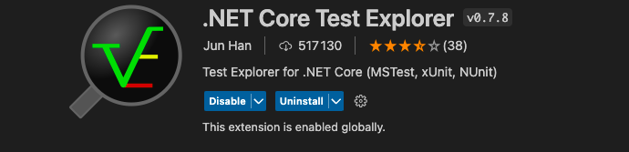
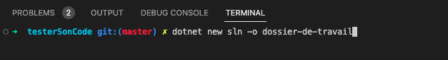
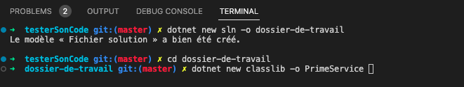
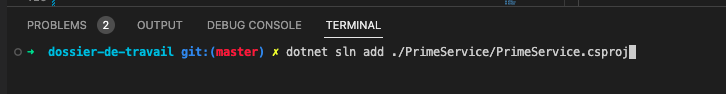
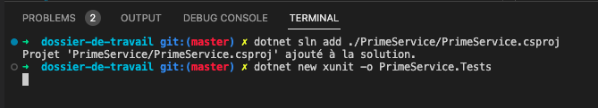
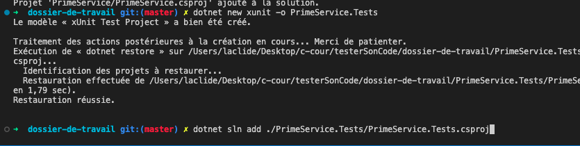
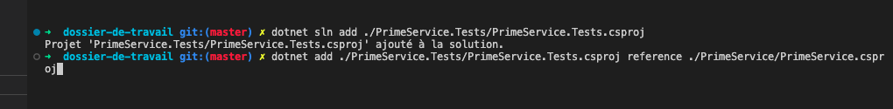
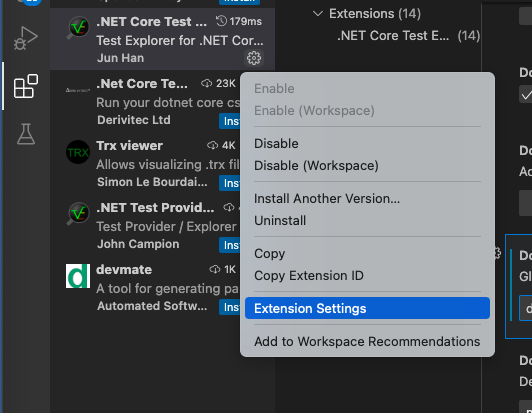
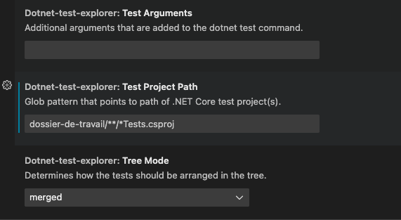
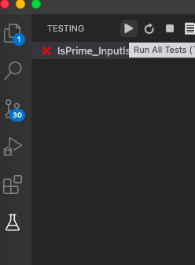

<link href="../Ressources/Theme/CSS/theme.css" rel="stylesheet">


# TesterSonCode

 
---

# Quel sont les besoin d'un développeur

---


## Introduction 
Lorsque l'on demande un produit a un développeur, celui ci doit s'assurer de rendre un travail fonctionnel.

Il doit aussi répondre au demande du client et produire un produit claire, scalable, et utilisable par d'autre que lui.

Il sera donc nécessaire pour vous d'automatiser le test de votre code, une dépense de temps qui vous en rapportera toujours plus que ce qu'il vous aura coûter.


---

# Pourquoi tester son code

---

## Pour vous

---

## Assurer que votre fonction fonctionne

Dans un premier temps,
Il serait bien vu que vos fonctions remplisse leurs objectifs principale.

Il serait dommage que l'utilisateur ayant un besoin précité et délégant sa charge de travail;
grâce a vos outils, n'atteigne pas ses objectifs.

Ou bien même vous; réutilisant votre code, cela pourrait avoir un effet boule de neige. Vous donnant des heures et des heures de travail pour trouver l'erreur.
Il est de bonne habitude de toujours tester son code.


---

## Sécuriser votre code

Tester permet aussi de se rendre compte de potentielles erreurs en cas d'argument invalide, d'overflow mal gérer, ou bien des condition non protège.


---

## Pour le client

---

## Assurer la robustesse du code

Le code subit de nombreux tests, et pour le client, ca montre que le produit fonctionne.

Il est mit a l’épreuve et apportera de la confiance en l'outil pour le client.


---

## Valider chaque demande Client

Par ailleurs le client vous demandera toujours des choses bien spécifique. 

Lorsque celui verra les batteries de tests, une confiance dans le produit et directement votre travail ce créera.

Car il n'est pas nécessaire que le client code.
Et même si c'est le cas;
Les tests permets de valider le cahiers des charges de manière bien plus élégante et plus sure pour les 2 partis.

---


# Tester son code 

---

## Documenter son code
L'avantage de la documentation, c'est une approche et une utilisation de l'outils de manière plus simple.

Ce ne sera pas toujours le cas. En réalité, il y aura beaucoup de moment ou le code ne sera pas documenter.

Tester le code permet de ce rendre compte des points fort et faible de celui-ci. Et une utilisation plus juste.

---

## Maintenir son code

Votre code évolue.
C'est un fait, que vous y touchiez ou non, les technologies de développement évolues et par conséquent le code base sur celui-ci évolue avec.

Avoir une base de test permet de vérifier si votre code est toujours stable, et fonction tel que vous le souhaitez.

Quand vous y apporterais des modifications, vous voudrez rajouter des implémentations ca sera encore plus vrai.

---

## Maintenir son code
En changeant / rajoutant du code dans vos classes, il se peut que certaines fonctionnalités casse. 

Vos tests permette de surveiller cas de manière automatique. Et ne pas avoir a toujours tout tester a la main.

---


# Qu'est ce que la TDD

</br>
Test Driven Developpement

---

## Principe du TDD

Le principe du TDD est simple. Il consiste a écrire un test avant d’écrire le code.

Ainsi, on s'assure que le code que l'on va écrire est bien celui qui est attendu par le test.

Il y a donc 3 étapes a suivre.

---


## Écrire un test

Écrire un test permet de définir les besoins du code.

C'est une étape primordiale dans le développement d'un projet.

---

## Écrire un code qui passe le test

Après avoir écris le test, il faut écrire le code qui permettra de passer ce test.

---


## Refactoriser le code

Lorsque le code passe le test, il faut réfléchir a comment améliorer le code.

Le but est de le rendre plus lisible, plus simple, et plus rapide.

---

## La boucle recommence

Votre code passe votre test.

Il faut écrire plus de test, et recommencer les étapes tout en faisant que les tests précédents continue de fonctionner.

Une fois tout les besoins tester, vous aurez correctement tester votre code.

---

## Cycle RGR (Red-Green-Refactor)

Le cycle red-green-refactor vous guidera dans l'écriture de vos tests.

red : Vous écrivez un test qui échoue, car le code n'est pas encore implémenté.(Le résultat sera rouge)

green : Vous écrivez le code pour que le test passe. (Le résultat sera vert)

Refactor : Vous refactorisez votre code pour le rendre plus lisible et plus maintenable. (Le résultat doit rester vert)

<!-- TODO mettre l'image de rgr -->
---

## Test unitaire

Soumettre une partie de code à un test
Il permet la mise en place d'un contrat entre le développeur et le client.

Ou le client peut :

- Tester le code
- Quantifier la qualité du code
- maintenir le code
- sécuriser le code

---


# Soumettre une partie du code a des tests unitaire

---


## Exemple de test

Demande du client : "Je veux que la fonction `add` retourne la somme de deux nombres"

```csharp
public class Test {
	public void testAdd() {
		Calculatrice calculatrice = new Calculatrice();
		int resultat = calculatrice.add(1, 2);
		Console.WriteLine("resultat         = " + resultat);
		Console.WriteLine("resultat attendu = 3");
	}
}
```

---

# Problematique de test

---

## Lisibilite des resultats

Faire des Console.WriteLine n'est pas de plus lisible quand on a 200 tests a fait et a comparer.

Trouver l'erreur puis la remonter pour voir le probleme...

---


## Maintenance des tests

Quand on a un grand nombre de test, il devient difficile de les maintenir.

Et de les faire passer.

---

## Repetition des tests

Il faut repeter les tests a chaque fois que l'on fait une modification.

Si on en oublie, on peut avoir un code qui ne fonctionne pas.

---

# Une solution : Xunit, automatiser ses tests

---

## Gain de temps

Avec Xunit vous pourrez automatiser vos tests,

Voir directements ce qui fail, 

Lorsque vous aurez bien maitrise l'outils de creation de test, un gain de temps est garantie.

---

## Gain de productivite

Vos test ce font sur un autre dossier, qui ira instancier vos classes. 

Cela laissera place net a votre code.
Pour mettre tout vos tests au même endroit.

Une modification de classe / methode;
Relancer la batterie de test tout en gardant quelque chose de lisible.

---

## Gain de qualite

Si vous etez rigoureux dans vos tests, cela ne rendra votre code que plus qualitatif.

---

## Gain de maintenabilite

Xunit est disponible sur toutes les versions de .net
Passez donc d'une version a l'autre et vos tests seront toujours compatible.

---

# Qu'est ce que Xunit

---

## Dotnet et Xunit

Xunit est disponible directement avec .Net
Donc pas de paquet a installer.

---

## Extension VSCode pour Xunit

Une extension VSCode est disponible pour plus de visibilite : 

`.NET Core Test Explorer`

Elle montrera avec plus de simplicite les tests qui echoue.

---

# Pourquoi utiliser Xunit?

---

## Xunit est simple d'utilisation

```
Si j'avais 6 heures pour abattre un arbre, je passerai les 4 premières à affuter ma hache. Abraham Lincoln
```

Xunit est tres simple d'utilisation,
Seul la mise en place requiere de connaitre quelque commande,

Et une bonne architecture de vos dossiers pour faciliter la suite.

---

## Tres populaire

Si vous etes perdu, avez quelque oublie dans le futur,
Xunit reste tres populaire, il est tres facile de retrouver sur internet des tutoriels, ou les commandes.

Donc pas de soucis a ce faire.

---


# Installation de Xunit

---

# Xunit deja present avec dotnet

---

## Installaton exentension VSCode

Nom de l'extension : 

```.NET Core Test Explorer```

Installer l'extension dans VScode (rappel voir pdf Installation VSCode)



---

# Architecture / premier pas  avec un tester 

---

## A quoi resemble l'architecture type

```txt
/dossier-de-travail
    dossier-de-travail.sln
    /Class
        Class.cs
        Class.csproj
    /Class.Tests
        Class_test_methode_A.cs
        ClassTests.csproj

```

---

## Mise en place

Ici nous construirons l'exemple suivant avec : 
- Une classe `PrimeService` qui nous permettera de verifier si un nombre est premier ou non. 


- Ouvrir un terminal et rentrer la commande suivante : 
`dotnet new sln -o dossier-de-travail`

---
## Mise en place



---

## Mise en place

Vous avez créer `dossier-de-travail` avec le fichie `.sln`

- Ouvrir un terminal a l'interieur du dossier.

- Et y rentrer la commande : `dotnet new classlib -o PrimeService`



---

## Mise en place
- Renommer `Class1.cs` en `PrimeService.cs`
    (clic droit sur Class1.cs --> rename )

- Remplacer le code dans `PrimeService.cs` avec le code ci-apres  

---
<!-- _backgroundImage: url(./Ressource/Theme/Flat.png) -->
```csharp
using System;

namespace Prime.Services
{
    public class PrimeService
    {
        public bool IsPrime(int candidate)
        {
            throw new NotImplementedException("Not implemented.");
        }
    }
}

```

---

## Mise en place

Toujours dans le dossier `dossier-de-travail`

- Entre dans le terminal : 
`dotnet sln add ./PrimeService/PrimeService.csproj`



---

## Mise en place

Maintenant on va créer le dossier de test,
- Entre dans le terminal : 
`dotnet new xunit -o PrimeService.Tests`



---


## Mise en place

Entre dans le terminal : 
`dotnet sln add ./PrimeService.Tests/PrimeService.Tests.csproj`



---


## Mise en place

Et pour finir, la commande qui va lier les 2 classes (classe de test et la classe dans laquel on codera nos fonction)
Entre dans le terminal :
`dotnet add ./PrimeService.Tests/PrimeService.Tests.csproj reference ./PrimeService/PrimeService.csproj`



---

## Les commandes

Resumer des commandes en breve, avec `ren` qui equivaut a `rename` que vous devrez changer selon votre OS (Window/Mac/Linux)
Et en remplacant le code dans votre class PrimeService : 

```
dotnet new sln -o unit-testing-using-dotnet-test
cd unit-testing-using-dotnet-test
dotnet new classlib -o PrimeService
ren .\PrimeService\Class1.cs PrimeService.cs
dotnet sln add ./PrimeService/PrimeService.csproj
dotnet new xunit -o PrimeService.Tests
dotnet add ./PrimeService.Tests/PrimeService.Tests.csproj reference ./PrimeService/PrimeService.csproj
dotnet sln add ./PrimeService.Tests/PrimeService.Tests.csproj
```

---

## Les commandes

Un peu de terminologies avant de rentrer dans le vif du code.

---


# La terminologies

---

## Test Unitaire (unit test)

C'est Tester un seul cas.

---

## Cas de test (case test)

C'est un fichier de test qui contient un ou plusieur test

---

## Suite de test (test suite)

C'est un fichier de test qui contien plusieur cas de test

---


# Test unitaite

---


## Quoi tester / c'est quoi un bon test

- Simple : il doit etre simple a ecrire et comprendre
- Precis : il doit tester une seul chose
- Independant : il ne doit pas dependre d'un autre test
- Reproductible : il doit pouvoir être exécuté plusieurs fois sans echec

---

## Methode de la Classes

Verifier les Methodes qui implique des conditions et boucles.

---

## Conditions de la classe

Verifier tout les elements dans la classes dependent du conditionnel.

---

## Tout les chemins possible

On appel chemins toutes les possibles direction que peut prendre une variable lors de l'executions du programme.

Il faut balayer au maximun le code et tester tout les chemins possible.

C'est important, d'autant plus que plus il y aura de la duplication de code, plus il y aura de chemin a emprunter

---

## Exemple 
une fonction a 2 chemins:

```csharp
bool isBiggerThan(int a, int b) {
    if (a < b) {
        return false;
    }
    return true;
}
```

---

## A eviter

## Getter / Setter
Getter et Setter sont tres souvent inutil a verifier car deja proteger de base par les classes de base du c#

---

# Principe Assertion

---

## Classes Assert pour les tests

Comment faire un test? 
Comment verifier une valeur?

La classes Assert est la pour ca,
elle vous permettera via des methodes ci-dessous de faire des comparaison avec le retours de fonction lors des tests unitaires.


---

## Equal

`Assert.AreEqual(obj, obj, string)`

Cette fonction va comparait 2 objects pour voir s'ils sont egaux.


S'ils ne le sont pas, retournera un exception avec comme message `string`
 
---

## NotEqual

`Assert.AreNotEqual(obj, obj, string)`

Cette fonction va comparait 2 objects pour voir s'ils sont differents. 

S'ils ne le sont pas, retournera un exception avec comme message `string`

---

## Contains

`Assert.Contains(string, string, string)`

Cette fonction va verifier que la premiere string est contenue dans la seconde.

Auquel cas la troiseme sera renvoyee en exception.

---

## DoesNotContains

`Assert.DoesNotContains(string, string, string)`

Cette fonction va verifier que la premiere string n'est pas contenue dans la seconde.

Auquel cas la troiseme sera renvoyee en exception.

---


## FALSE

`Assert.False(bool, string)`

Cette fonction va verifier que la valeur est false. Auquel cas la deuxieme sera renvoyee en exception.

---


## TRUE

`Assert.True(bool, string)`

Cette fonction va verifier que la valeur est true. Auquel cas la deuxieme sera renvoyee en exception.

---

## IsType

`Assert.IsType(type, obj, string)`

Cette fonction va verifier que la valeur est du type. Auquel cas la deuxieme sera renvoyee en exception.

---


# Mot clef Pour la classe de test

---

## [Fact]

L'attribut [Fact] déclare une méthode de test qui est exécutée par le programme d'exécution des tests.

---


## [Theory]

[Théorie] représente une suite de tests qui exécutent le même code mais avec des arguments d'entrée différents.

---

## [InlineDate]


L'attribut [InlineData] spécifie les valeurs de ces entrées.

---

# Pratique, initialisation du visualisateur

---

## Pratique

Maintenant que nous avons toutes les clefs en mains, 
Il est l'heure de voir ca dans la pratique.

Mais avant ca... 
Dans exetension, aller dans les settings de l'extension `.NET Core Test Explorer`

---





---
## Pratique
Remplir le champ indique avec `dossier-de-travail/**/*Test.csproj`



--- 

## Setup Xunit Extension
L'objectif est que vous compreniez que le champs a remplir ici permet de rechercher tout les tests a executer.

Pour vos prochains projet

---

## Setup Xunit Extension

- premierement nous allons mettre le dossier ou ce trouve vos tests ici : `dossier-de-travail`


- `**` signifie a chercher a travers tout les sous dossier

- `*Test.csproj` signigie tout les fichiers qui ce finissent par `Test.csproj`

---

## Setup Xunit Extension
Donc `dossier-de-travail/**/*Test.csproj` signifie : 

Dans le dossier `dossier-de-travail` je veux tout les fichiers qu'ils se trouvent dans des sous-dossiers ou non qui ce finissent par `*Test.csproj`.


---


# Pratique (TP pas a pas)

---

## Rappel des objectifs

- Nous voulons mettre en place une classe avec une methode qui nous permettera de verifier si un nombre est premier.

- Un nombre premier est un nombre qui n'est divisible que par lui-même et 1 (1 est exclue)

---

## créer mon premier test

- Je créer mon test avant de faire mon code, pour determiner mes objectif.

- 1 n'est pas premier donc mon test portera sur ca.

Dans votre code de test (unitTest1.cs)
Remplacez le code par : 

---
<!-- _backgroundImage: url(./Ressource/Theme/Flat.png) -->
```csharp
using Xunit;
using Prime.Services;

namespace Prime.UnitTests.Services
{
    public class PrimeService_IsPrimeShould
    {
        [Fact]
        public void IsPrime_InputIs1_ReturnFalse()
        {
            var primeService = new PrimeService();
            bool result = primeService.IsPrime(1);

            // Use Assert methode to check if result is not prime
        }
    }
}
```

---


## Reponce :

```csharp
Assert.False(result, "1 should not be prime");
```


---

## Run le test



---

## Ecrire le test --> coder

Seconde etape maintenant c'est de coder la solution qui remplirais les besoins du test.

- Dans `PrimeService.cs` remplacer la methode `IsPrime` par

---
<!-- _backgroundImage: url(./Ressource/Theme/Flat.png) -->

```csharp
public bool IsPrime(int candidate)
{
    if (candidate == 1)
    {
        return false;
    }
    throw new NotImplementedException("Not fully implemented.");
}
```

Puis run le test encore.

---

## Test-valide, Ajoutez plus de test

Supprimons le test unitaire precedans pour generaliser le cas, remplacer `IsPrime_InputIs1_ReturnFalse` par :

---

<!-- _backgroundImage: url(./Ressource/Theme/Flat.png) -->
```csharp
private readonly PrimeService _primeService;

public PrimeService_IsPrimeShould()
{
    _primeService = new PrimeService();
}


[Theory]
[InlineData(-1)]
[InlineData(0)]
[InlineData(1)]
public void IsPrime_ValuesLessThan2_ReturnFalse(int value)
{
    var result = _primeService.IsPrime(value);

    Assert.False(result, $"{value} should not be prime");
}
```

---

## Test-valide, Ajoutez plus de test

Ici nous emploierons les mots clefs :
- [Theory] : suite de test
- [InlineData] : valeur specifique du test

Nous allons tester notre programe avec les valeurs suivantes : `-1, 0, 1`

Run les tests

---


## Ecrire le test --> coder

Remplacer la methode IsPrime par 

```csharp
public bool IsPrime(int candidate)
{
    if (candidate < 2)
    {
        return false;
    }
    throw new NotImplementedException("Not fully implemented.");
}
```

Run les tests


---

## Test-valide, Ajoutez plus de test

Coder des tests pertinent qui casserons la méthode IsPrime.

---

## Écrire le test --> coder  

- Écrire un code IsPrime qui tiendra la route (pas comme les codes précédents qui faisait office d'exemple).

- Écrire des tests pour vérifier votre code. Et rendez une méthode fonctionnelle.